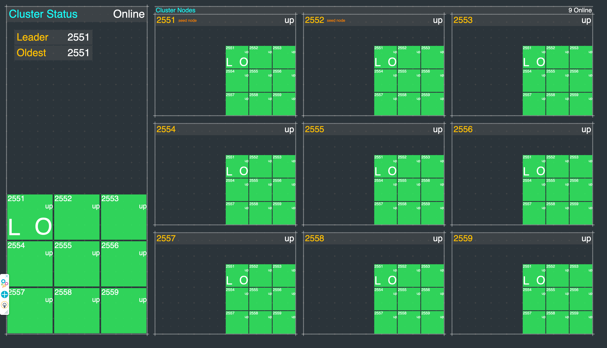
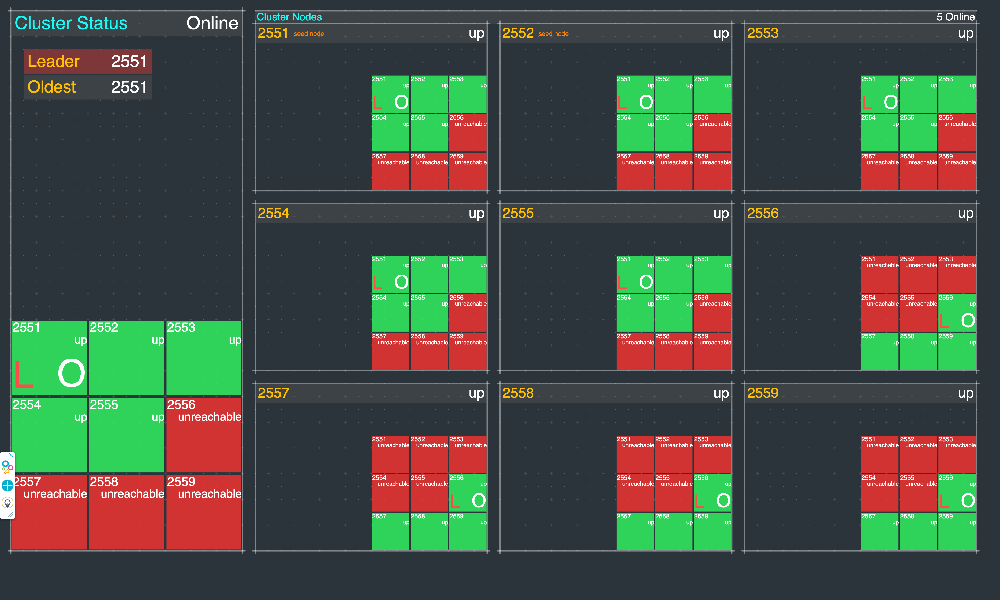
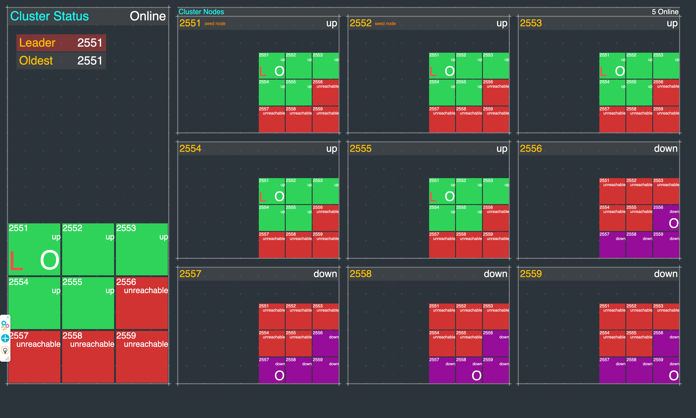
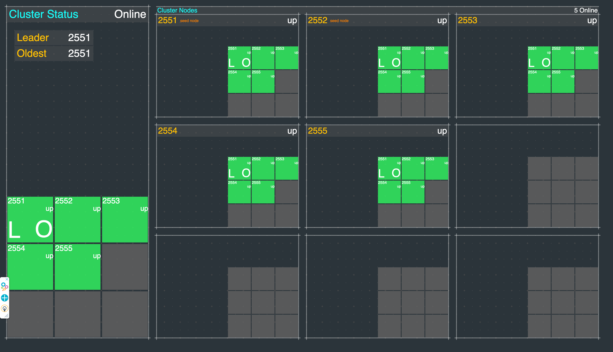

## Akka Java Cluster SBR Example

This is a Java, Maven, Akka project that demonstrates how to setup a basic
[Akka Cluster](https://doc.akka.io/docs/akka/current/typed/index-cluster.html).

This project is one in a series of projects that starts with a simple Akka Cluster project and progressively builds up to examples of event sourcing and command query responsibility segregation.

The project series is composed of the following GitHub repos:
* [akka-typed-java-cluster](https://github.com/mckeeh3/akka-typed-java-cluster)
* [akka-typed-java-cluster-sbr](https://github.com/mckeeh3/akka-typed-java-cluster-sbr) (this project)
* [akka-typed-java-cluster-aware](https://github.com/mckeeh3/akka-typed-java-cluster-aware)
* [akka-typed-java-cluster-singleton](https://github.com/mckeeh3/akka-typed-java-cluster-singleton)
* [akka-typed-java-cluster-sharding](https://github.com/mckeeh3/akka-typed-java-cluster-sharding)
* [woe-sim](https://github.com/mckeeh3/woe-sim) an example of 
[Akka Persistence](https://doc.akka.io/docs/akka/current/typed/index-persistence.html)
* [woe-twin](https://github.com/mckeeh3/woe-twin) an example of 
[Akka Persistence](https://doc.akka.io/docs/akka/current/typed/index-persistence.html)
 and 
[Akka Projections](https://doc.akka.io/docs/akka-projection/current/)

Each project can be cloned, built, and runs independently of the other projects.

This Split Brain Resolver project is a clone of the [`akka-typed-java-cluster`](https://github.com/mckeeh3/akka-typed-java-cluster) project.
A few things were added to this project, mainly enabling the Aka SBR feature, and adding some additional scripts needed to trigger network partitions.

### About this Akka Split Brain Resolver Project

This project is set up to manually trigger network partitions. The provided cluster dashboard visualizes the sequence of events that occur when a running Akka cluster encounters a network partition. The project includes a sample Java Akka Cluster project, scripts for controlling clusters, and a web based cluster dashboard for observing changes in cluster node states as they happen.

Please see the [Split Brain Resolver](https://doc.akka.io/docs/akka/current/split-brain-resolver.html#split-brain-resolver) documentation for details.

### Installation

~~~bash
$ git clone https://github.com/mckeeh3/akka-typed-java-cluster-sbr.git
$ cd akka-typed-java-cluster-sbr
$ mvn clean package
~~~

The Maven command builds the project and creates a self contained runnable JAR.

### Run a cluster (Mac, Linux, Cygwin)

The project contains a set of scripts that can be used to start and stop individual cluster nodes or start and stop a cluster of nodes.

The main script `./akka` is provided to run a cluster of nodes or start and stop individual nodes.

~~~bash
$ ./akka
~~~
Run the akka script with no parameters to see the available options.
~~~
This CLI is used to start, stop and view the dashboard nodes in an Akka cluster.

These commands manage the Akka cluster as defined in this project. A cluster
of nodes is started using the JAR file built with the project Maven POM file.

Cluster commands are used to start, stop, view status, and view the dashboard Akka cluster nodes.

./akka cluster start N | stop | status | dashboard [N]
./akka cluster start [N]      # Starts one or more cluster nodes as specified by [N] or default 9, which must be 1-9.
./akka cluster stop           # Stops all currently cluster nodes.
./akka cluster status         # Shows an Akka Management view of the cluster status/state.
./akka cluster dashboard [N]  # Opens an Akka cluster dashboard web page hosted on the specified [N] or default 1, which must be 1-9.

Node commands are used to start, stop, kill, down, or tail the log of cluster nodes.
Nodes are started on port 255N and management port 855N, N is the node number 1-9.

./akka node start N | stop N | kill N | down N | tail N
./akka node start N...  # Start one or more cluster nodes for nodes 1-9.
./akka node stop N...   # Stop one or more cluster nodes for nodes 1-9.
./akka node kill N...   # Kill (kill -9) one or more cluster nodes for nodes 1-9.
./akka node down N...   # Down one or more cluster nodes for nodes 1-9.
./akka node tail N      # Tail the log file of the specified cluster node for nodes 1-9.

Net commands are used to block and unblock network access to cluster nodes.

./akka net block N | unblock | view | enable | disable
./akka net block N...  # Block network access to node ports, ports 255N, nodes N 1-9.
./akka net unblock     # Reset the network blocking rules.
./akka net view        # View the current network blocking rules.
./akka net enable      # Enable packet filtering, which enables blocking network access to cluster nodes. (OSX only)
./akka net disable     # Disable packet filtering, which disables blocking network access to cluster nodes. (OSX only)
~~~

The `cluster` and `node` start options will start Akka nodes on ports 2551 through 2559.
Both `stdin` and `stderr` output is sent to a log files in the `/tmp` directory using the file naming convention `/tmp/<project-dir-name>-N.log`.

Start a cluster of nine nodes running on ports 2551 to 2559.
~~~bash
$ ./akka cluster start
~~~
~~~
Starting 9 cluster nodes
Start node 1 on port 2551, management port 8551, HTTP port 9551
Start node 2 on port 2552, management port 8552, HTTP port 9552
Start node 3 on port 2553, management port 8553, HTTP port 9553
Start node 4 on port 2554, management port 8554, HTTP port 9554
Start node 5 on port 2555, management port 8555, HTTP port 9555
Start node 6 on port 2556, management port 8556, HTTP port 9556
Start node 7 on port 2557, management port 8557, HTTP port 9557
Start node 8 on port 2558, management port 8558, HTTP port 9558
Start node 9 on port 2559, management port 8559, HTTP port 9559
~~~

Stop all currently running cluster nodes.
~~~bash
$ ./akka cluster stop
~~~
~~~
Stop node 1 on port 2551
Stop node 2 on port 2552
Stop node 3 on port 2553
Stop node 4 on port 2554
Stop node 5 on port 2555
Stop node 6 on port 2556
Stop node 7 on port 2557
Stop node 8 on port 2558
Stop node 9 on port 2559
~~~

Stop node 3 on port 2553.
~~~bash
$ ./akka node stop 3
~~~
~~~
Stop node 3 on port 2553
~~~

Stop nodes 5 and 7 on ports 2555 and 2557.
~~~bash
$ ./akka node stop 5 7
~~~
~~~
Stop node 5 on port 2555
Stop node 7 on port 2557
~~~

Start node 3, 5, and 7 on ports 2553, 2555 and2557.
~~~bash
$ ./akka node start 3 5
~~~
~~~
Start node 3 on port 2553, management port 8553, HTTP port 9553
Start node 5 on port 2555, management port 8555, HTTP port 9555
Start node 7 on port 2557, management port 8557, HTTP port 9557
~~~

Start a cluster of four nodes on ports 2551, 2552, 2553, and 2554.
~~~bash
$ ./akka cluster start 4
~~~
~~~
Starting 4 cluster nodes
Start node 1 on port 2551, management port 8551, HTTP port 9551
Start node 2 on port 2552, management port 8552, HTTP port 9552
Start node 3 on port 2553, management port 8553, HTTP port 9553
Start node 4 on port 2554, management port 8554, HTTP port 9554
~~~

Again, stop all currently running cluster nodes.
~~~bash
$ ./akka cluster stop
~~~

The `./akka cluster status` command displays the status of a currently running cluster in JSON format using the
[Akka Management](https://developer.lightbend.com/docs/akka-management/current/index.html)
extension
[Cluster Http Management](https://developer.lightbend.com/docs/akka-management/current/cluster-http-management.html).

### The Cluster Dashboard ###

Included in this project is a cluster dashboard. The dashboard visualizes live information about a running cluster.  

~~~bash
$ git clone https://github.com/mckeeh3/akka-typed-java-cluster-sbr.git
$ cd akka-typed-java-cluster-sbr
$ mvn clean package
$ ./akka cluster start
$ ./akka cluster dashboard
~~~
Follow the steps above to download, build, run, and bring up a dashboard in your default web browser.

### Manually Trigger a Network Partition

Follow these steps to manually introduce a network partition.

These steps have been tested with Linux and Mac OSX.

On the OSX, before starting an Akka cluster manually enable `localhost2`. This step is not requires for Linux systems.

~~~bash
$ sudo ./akka net enable
$ sudo ./akka net localhost2 create
~~~
~~~
Create localhost alias on IP 127.0.0.2 (OSX)
~~~

Start a cluster with the default 9 nodes. Then start the dashboard.

~~~bash
$ ./akka cluster start
$ ./akka cluster dashboard
~~~

Wait for all of the node to start showing a green up status on the dashboard.

Next, manually introduce a network partition between the first 5 nodes running on 127.0.0.1 and the last 4 nodes running on 127.0.0.2.

~~~bash
$ sudo ./akka net partition on
~~~

In a few moments, the dashboard should look like the above image—nodes 1 through 5 each show green with nodes 6 through 9 showing red. The partition has stopped network traffic from the first five nodes to the last four nodes. The first five nodes can communicate with each other, so they show a green status.

The bottom four nodes can communicate with each other, but they are unable to communicate with any of the first five nodes running on 127.0.0.1. This view demonstrates a classic network partition or split-brain.

When network partitions occur, the Akka clusters will wait for a configured period of time in the hopes that the issue will resolve itself. The `akka.cluster.split-brain-resolver.stable-after` configuration setting defines how long the SBR resolver will wait before taking action. There are multiple [SBR Stratigies](https://doc.akka.io/docs/akka/current/split-brain-resolver.html#strategies) available. In this demo, the default keep majority strategy is used.

Once the SBR `stable-after` wait period is over, the SBR on each side of the network partition kicks in, and they both independently decide how to resolve the issue. With the SBR keep majority strategy, the partition with the most remaining nodes stays up, and the partition with the least number of nodes shuts down. In the above screenshot, the four bottom nodes are downed by the SBR on the majority side of the partition. Simultaneously, the nodes on the other side of the  partition are shut down by the SBR.

Now that the two split clusters have completed the SBR actions, there is one remaining cluster with five nodes.

Before starting any new nodes, it is necessary to turn off the partition.

~~~bash
$ sudo ./akka net partition off
$ ./akka node start 6 7 8 9
~~~~

In this demo, the downed and stopped nodes are manually restarted. In an orchestration environment, such as Kubernetes, the downed node would automatically be replaced.
